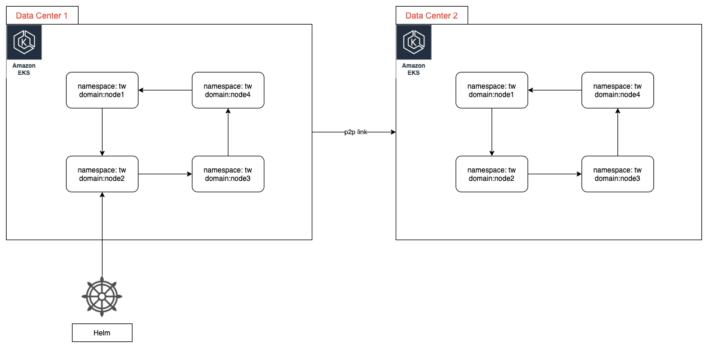
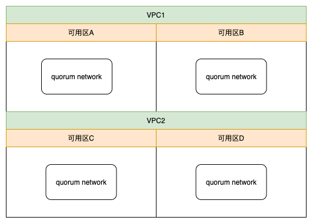

# 1. Deployment Architecture

Date: 2020-07-14

## Status

2020-07-14 proposed

## Context

Deploy quorum with terraform and k8s

### 业务需求
1. 自动化启动最小的quorum网络
2. 自动化起N节点，加入到1所创建的网络，组件联盟
3. 1所创建的网络，需要对外有域名可以访问
4. 当小于三分之一的节点有问题时，整个区块链网络不受影响

### 安全性需求
1. 网络只有指定域名的服务器可以访问
2. 更新合约需要通过CI机器，不能再本地更新

### 技术需求
1. 组件联盟，指定不同域名，比如org1.quorum.com
2. 基于raft共识，不出空块
3. 使用tessera支持私有交易
4. 节点启动有自定义的10个账号，分配100eth
5. 有监控，磁盘满了可以自动增加

### 云部署高可用
使用不同的可用区，防止可用区出问题
使用EKS，防止k8s有问题
支持不同的数据中心互联共建网络，数据中心可以是同一云的VPC，也可以是异构云的VPC，也可以是自建IDC。

### 里程碑
1. 部署一个节点的helm配置，4节点组网的方法，每个节点在不同的namespace，有自己端口和域名，quorum是如何配置发现节点，配置personal账号
2. 使用EKS，k8s变成集群，使用至少2个可用区，有监控，磁盘满的时候增加磁盘。
3. 保证网络可用的情况下，使用轻节点，只在少量节点中保存全量数据
4. 使用多个数据中心或区域

### k8s 部署企业以太坊

上图显示了两个数据中心，我们使用Helm部署quorum节点，分别部署了quorum网络，代表不同的公司，通过p2p协议组成了联盟链。在k8s内部，使用namespace划分不同的域名，quorum节点通过域名互相在内网发现。k8s需要使用一个公网ip让其他网络可以发现本网络，同时quorum需要验证对方是否有合法的证书可以接入网络。对于合约的部署，需要有白名单机制，让规定的用户上传到网络。

### 云的管理

云环境一般都提供了 VPC，VPC下有可用区，可用区隔离了电力，机房等硬件环境，我们为了提高可用性，可以把quorum最小网络部署在不同的VPC和可用区。

## Decision

按照里程碑分布开发，首先完成M1： 部署一个节点的helm配置，4节点组网的方法，每个节点在不同的namespace，有自己端口和域名，quorum是如何配置发现节点，配置personal账号。

tasks:
1. 部署一个节点的helm配置，每个节点在不同的namespace，有自己端口和域名
2. 4节点组网的方法
3. 使用raft共识
4. 给一个公网ip和域名到整个网络

## Consequences

Consequences here...
