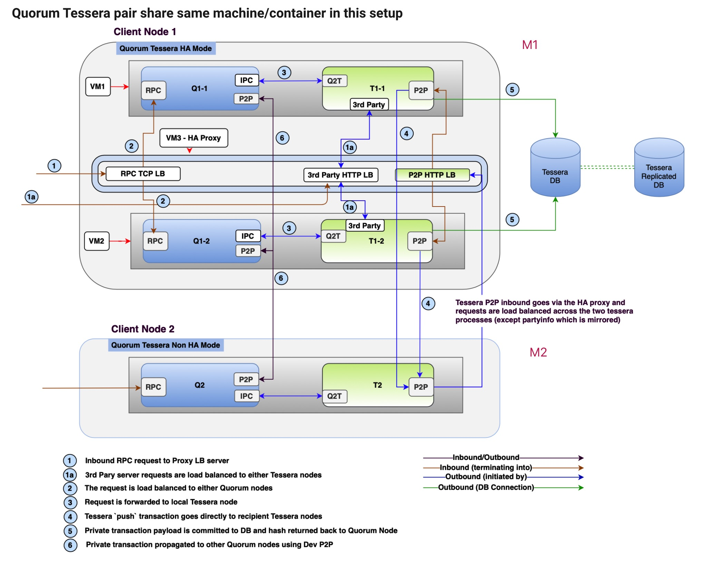
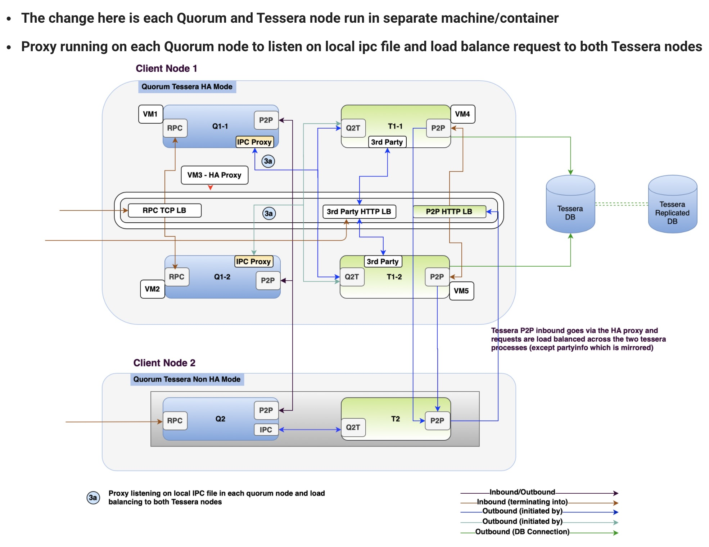
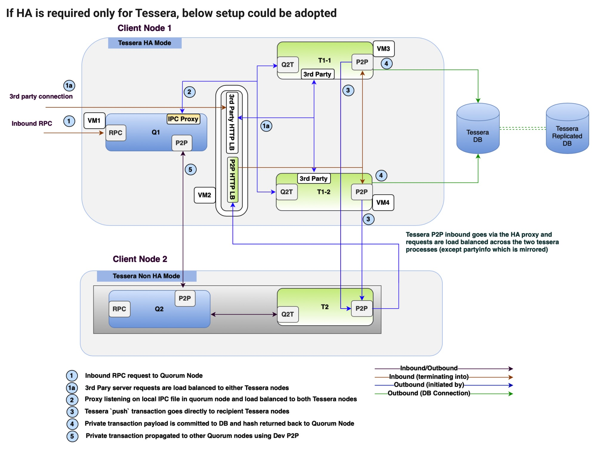

# 1. Deployment Architecture

Date: 2020-07-14

## Status

2020-07-14 proposed

## Context

### 当下问题

使用docker-compose在一台ec2上部署了7个节点，并且磁盘使用的和业务服务是一样的，会遇到以下问题：
   1. 磁盘不够用，因为和业务服务在一起，没法换成便宜的磁盘，会影响业务服务功能
   2. 单点故障，ec2重启所有节点都重启
   3. 重启一个节点不方便
   4. 加入一个节点不方便
   5. 修改配置麻烦

### 业务需求
1. 自动化启动最小的quorum网络
2. 启动一个节点，加入到1所创建的网络，组件联盟
3. 1所创建的网络，需要对外有域名可以访问
4. 当小于三分之一的节点有问题时，整个区块链网络不受影响

### 安全性需求
1. 网络只有指定域名的服务器可以访问
2. 更新合约需要通过CI机器，不能再本地更新
3. 加入网络的quorum节点需要有白名单机制

### 技术需求
1. 组件联盟，指定不同域名，比如org1.quorum.com
2. 基于raft共识，不出空块
3. 使用 tessera 支持私有交易
4. 节点启动有自定义的10个账号，分配100eth
5. 有监控，磁盘满了可以自动增加

### 云部署高可用
1. 使用不同的可用区，防止可用区出问题
2. 使用EKS，防止k8s有问题
3. 支持不同的数据中心互联共建网络，数据中心可以是同一云的VPC，也可以是异构云的VPC，也可以是自建IDC。
4. tessera 有高可用方案
5. quorum 有高可用方案

### 里程碑

#### M1. 主要目标：内网quorum高可用

使用 k8s，部署quorum 节点在不同的 pod 上，挂载各自的磁盘，可以使用多台机器

|checklist|作用|是否完成|
|--- | --- | --- |
| 使用 helm 部署 | 一键建立网络，一键删除 | 是|
| 配置静态组网 | 不让其他节点加入 | 是 | 
| 配置 tessera 权限 | 不允许发起私有交易 | 是 |
| 设置创世区块 | 分配 personal 账号和 eth | 是 | 
| 使用 EKS | k8s 可以管理多台机器，本身高可用 | 否，weili有单独的卡追踪 |
| 每个节点在不同 namespace，有自己端口和域名 | 隔离网络，管理 | 否 |
| 抽离 helm 内部各种配置 | 生产环境不能用默认私钥 | 否 |
| 有对外域名访问网络 | EIP+LB对外提供节点访问 | 否，目前在内网 |
| 使用1T低价格磁盘给quorum | quorum需要大容量磁盘 | 否，weili有单独的卡追踪 |
| 使用多台 EC2 | 防止 EC2 资源不足 | 否，weili有单独的卡追踪 | 

#### M2. 主要目标：动态组网

启动一个节点加入网络

|checklist|作用|是否完成|
|--- | --- | --- |
| 启动 quorum 加入网络 | 组成联盟 | 否，有手动方法 |
| 启动 quorum + tessera 加入网络 | 可以发起私有交易 | 否，有手动方法 |
| 不启动 tessera 组件7nodes | 简化网络 | 否 |

#### M3. 主要目标：内网 tessera 高可用

|checklist|作用|是否完成|
|--- | --- | --- |
| tessera 多服务 | tessera 是java+数据库服务，可以部署多个，用 lb 负载 | 否 |
| tessera 和 quorum 部署在不同 container | tessera 和 quorum 互不影响 |否 |
| tessera 数据库 HA | 数据库高可用， tessera使用同一个数据库| 否 |
| LB HA | LB 高可用 | 否，内网可以依赖 k8s 的 service |
| tessera 切换数据库 | 当前数据库是 H2 | 否 | 

#### M4. 异构网络组网

|checklist|作用|是否完成|
|--- | --- | --- |
| 联盟中的各个节点在不同可以用区 | 保证可用区容灾 | 否 |
| 在不同 PVC | 异构网络组网 | 否 |
| tessera数据库如何处理 | 异构网络组网 | 否 |

### M1+M2 部署图

1. 上图 VM 可以看成 K8s Pod 中的 container.
2. 图片上部分是 M1 目标
2. 图片下部分是 M1 目标
3. M1,M2 不包含 P2P LB（需要调研，不太明确其作用）

### M3 部署图1

Tessera 在自己的 container 中

### M3 部署图2

### M3 多数据中心

上图显示了两个数据中心，我们使用Helm部署quorum节点，分别部署了quorum网络，代表不同的公司，通过p2p协议组成了联盟链。在k8s内部，使用namespace划分不同的域名，quorum节点通过域名互相在内网发现。k8s需要使用一个公网ip让其他网络可以发现本网络，同时quorum需要验证对方是否有合法的证书可以接入网络。对于合约的部署，需要有白名单机制，让规定的用户上传到网络。

### M3 多数据中心云的管理

云环境一般都提供了 VPC，VPC下有可用区，可用区隔离了电力，机房等硬件环境，我们为了提高可用性，可以把quorum最小网络部署在不同的VPC和可用区。

## Decision

按照里程碑分布开发，首先完成M1

## Consequences

Consequences here...

## 参考资料

1. [How-To-Guides/HA_Setup](http://docs.goquorum.com/en/latest/How-To-Guides/HA_Setup/)
2. [7nodes Example](https://github.com/jpmorganchase/qubernetes/tree/master/7nodes)
3. [Data recovery](https://docs.goquorum.com/en/latest/Privacy/Tessera/Tessera%20Services/Transaction%20Manager/)
4. [https://medium.com/@arun.s/running-tessera-with-postgres-ea182d6aefb3](https://medium.com/@arun.s/running-tessera-with-postgres-ea182d6aefb3)