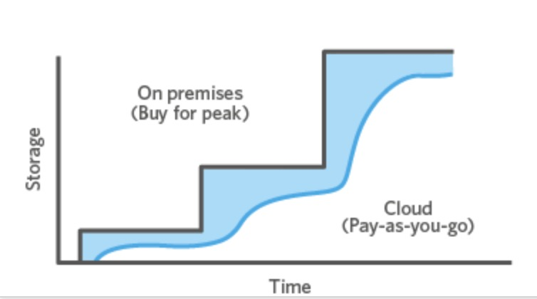
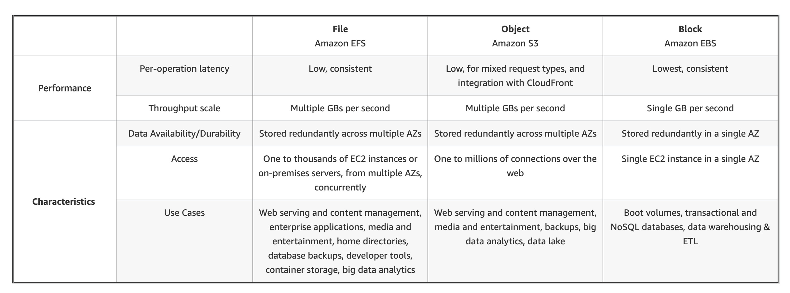

# 2. cloud file storage

Date: 2020-08-04

## Status

2020-08-04 proposed

## Context

### 当下磁盘的问题
现在购买磁盘挂载，有以下缺点
1. EBS贵
2. 弹性伸缩不方便
3. 权限控制不方便，只能挂载给EC2
4. 磁盘类型选择不方便，比如使用对于速度有不同要求的磁盘或者长时间不访问的磁盘

### 云存储种类
1. 对象存贮，API直接存贮对象，比如视频，文件
2. 文件存贮，满足需要一个文件系统的需求
3. Block-based cloud storage - 超低延迟

### 使用EFS云存贮的好处
1. 弹性，用多少算多少
2. 互操作性，可以方便的共享，跨数据中心，VPC，AZ
3. 节省资源



### EFS与EBS区别

1. EBS抽象级别是硬盘，低延迟
2. EFS抽象级别是网络磁盘，延迟比EBS大
3. EFS不需要去管理硬盘，使用更方便
4. EBS综合计算贵一下


https://aws.amazon.com/cn/efs/tco/

### Amazon EFS 种类

Amazon EFS 有两种类型: 
1. 标准存贮
2. Infrequent Access storage class (EFS IA). 不常访问的存贮可以用来节省成本


### 吞吐，延迟，费用

Amazon EFS 旨在提供 Linux 工作负载所需的吞吐量、IOPS 以及低延迟。吞吐量和 IOPS 随着文件系统的扩大而扩展，可以在短时间内快速达到更高的吞吐量级别，以支持文件工作负载的不可预测的性能需求。对于要求最苛刻的工作负载，Amazon EFS 可以支持超过 10GB/秒和超过 500000 IOPS 的性能。

EFS 标准存储费用为 0.59 CNY/GB/Month

Amazon EFS 提供标准和不经常访问存储类。标准存储类是为活动文件系统工作负载而设计的，您只需为每月使用的文件系统存储付费。EFS 不频繁访问 (EFS IA) 是一种成本较低的存储类，针对不经常访问的文件进行了成本优化。存储在 EFS IA 存储类中的数据成本比标准存储类低 85%，每次读取或写入文件时都需要支付费用。EFS 文件系统透明地提供来自两个存储类的数据。

在读取或写入 EFS IA 时，您的第一字节延迟会高于 EFS 标准。EFS 标准旨在提供个位数的平均延迟，而 EFS IA 旨在提供两位数的平均延迟。



### EKS 支持 EFS

1. [Amazon EFS CSI 驱动程序](https://docs.aws.amazon.com/zh_cn/eks/latest/userguide/efs-csi.html)
2. [efs-provisioner](https://github.com/kubernetes-incubator/external-storage/tree/master/aws/efs)

> 方法二实验在中国区无法正确创建PV，推荐使用方法1.

将 Amazon EFS CSI 驱动程序部署到 Amazon EKS 集群
```sh
kubectl apply -k "github.com/kubernetes-sigs/aws-efs-csi-driver/deploy/kubernetes/overlays/stable/?ref=master"
```


## Decision

1. 目前认为 EFS 更加便宜，好运维，不需要关注磁盘大小。
2. 但是EFS延迟比EBS大，需要进一步测试

## Consequences

Consequences here...

## 参考资料

1. [云文件存储](https://aws.amazon.com/cn/what-is-cloud-file-storage/)
2. [Amazon Elastic File System](https://aws.amazon.com/cn/efs/)
3. [Amazon EFS 常见问题](https://aws.amazon.com/cn/efs/faq/)
4. [Amazon EBS vs EFS vs S3: Picking the Best AWS Storage Option for Your Business](https://www.missioncloud.com/blog/resource-amazon-ebs-vs-efs-vs-s3-picking-the-best-aws-storage-option-for-your-business)
5. [Creating mount targets](https://docs.aws.amazon.com/efs/latest/ug/accessing-fs.html)
6. [aws--efs---使用efs创建k8s的动态pvc](https://blog.csdn.net/zzq900503/article/details/105077967)
7. [使用 Amazon EFS 资源](https://docs.aws.amazon.com/zh_cn/efs/latest/ug/creating-using.html)
8. [When to Choose Amazon EFS](https://aws.amazon.com/cn/efs/when-to-choose-efs/)
9. [利用 EFS 快速搭建 NFS 文件系统 - DNS Issue 解决办法](https://blog.csdn.net/zzq900503/article/details/105074948)
10. [Performance of aws-efs-csi-driver vs. aws efs provisioner](https://github.com/kubernetes-sigs/aws-efs-csi-driver/issues/83)
11. [EFS 创建十分钟教程](https://www.amazonaws.cn/getting-started/tutorials/create-network-file-system/?&trk=el_a131L0000057zhiQAA&trkCampaign=CSI_Q2_2019_create-network-file-system_page&sc_channel=el&sc_campaign=CSI_08_2019_Storage_EFS_Console&sc_outcome=CSI_Digital_Marketing)
12. [efs-provisioner](https://github.com/kubernetes-incubator/external-storage/tree/master/aws/efs)